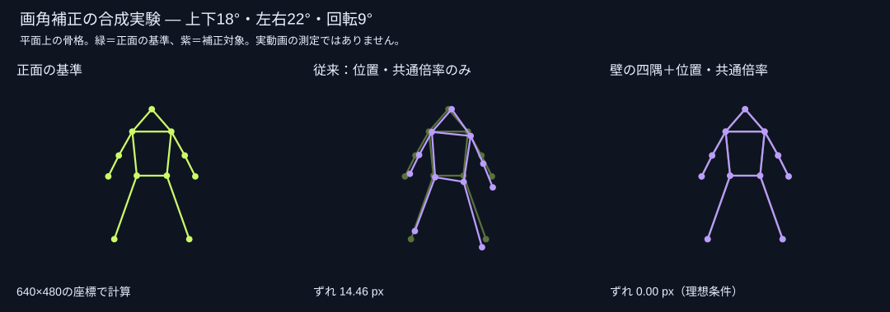

# 画角補正の調査と試作

調査日：2026-09-08。今回の目的は、ヲタ芸の前屈・足幅・体格をカメラの傾きと取り違える補正を避け、動画同士を見比べやすくすること。

## 比較した方法

| 方法 | 得意なこと | 今回の判断 |
|---|---|---|
| 人体の対応点を射影変換で一致させる | 人物を見かけ上重ねる | 肩幅・脚の長さ・足幅・前屈も変形に吸収するので、画角の推定には採用しない |
| 背景の水平線2点 | 選んだ線を画面で水平にする | 軽い補助として実装。線の奥行き方向でも傾いて見えるため、カメラの真のロール角を推定したとは扱わない |
| 壁・窓などの長方形4点＋実物の縦横比 | 平面の左右・上下の遠近と回転 | 今回の主な試作として実装。人体から独立した基準を使い、各動画を個別に補正する |
| 複数の消失点・基準長からのカメラ推定 | 背景の幾何から方向や尺度を推定 | 有力だが、平行線・垂直方向などの条件が必要。今回は四隅指定で操作量を抑える |
| 3D骨格の正規化・関節角特徴 | 撮影方向や体格が違う動作の比較 | 将来のフォーム比較向け。動画の画素を別視点から描き直す機能とは別であり、今回は未実装 |

OpenCVの説明ではホモグラフィは平面間の対応を表し、四隅の対応から射影変換を求められる。これを人体全体に適用しても、平面から外れた手足の視差までは解消しない。今回の方式は近くの壁面などを基準にした平面近似であり、カメラの焦点距離・3D姿勢を推定したものではない。[OpenCV: Homography](https://docs.opencv.org/4.13.0/d9/dab/tutorial_homography.html)

背景の幾何を使う方向はSingle View Metrologyにも基づく。消失線や垂直方向の消失点など、場面の制約を使う研究で、任意の画像から条件なしで正確な形を戻す手法ではない。[Microsoft Research: Single view metrology](https://www.microsoft.com/en-us/research/publication/single-view-metrology-4/)

MediaPipeは画像座標と3Dのworld landmarksを出力する。一方、Normalized Human Pose Features for Human Action Video Alignmentは体格・視点の差に強い骨格表現を扱い、2Dから3Dへの復元には投影の曖昧さがあることも述べる。これらはフォーム比較の改善候補であり、隠れた衣服や手足の映像を復元できる根拠にはしない。[MediaPipe Pose Landmarker](https://developers.google.com/edge/mediapipe/solutions/vision/pose_landmarker)、[ICCV 2021 論文](https://hongbofu.people.ust.hk/doc/Normalized%20Human%20Pose%20Features_ICCV2021.pdf)

## 今回の合成実験

ピンホールカメラで同一の平面骨格を撮影した座標を作成。640×480画面上で、位置と共通の高さ倍率を合わせた後の11点のRMS誤差を比較した。補正の基準は人体とは独立した、幅1.3・高さ2.0の壁の四角。カメラの距離は4.0、焦点距離は650px。実動画の精度評価ではない。

| カメラの変化 | 従来の位置・共通倍率のみ | 壁の四隅で補正後 |
|---|---:|---:|
| 上下20° | 9.04px | 数値誤差程度（0.00px） |
| 左右25° | 7.37px | 数値誤差程度（0.00px） |
| 上下18°・左右22°・回転9° | 14.46px | 数値誤差程度（0.00px） |

四隅を各方向に1pxずらすと、複合角度のケースでは誤差が1.12px残った。同じ補正を固定して足幅・腕の形だけ変えた平面骨格も正面の形に戻り、ポーズの差を基準に補正を再推定していないことを確認した。

一方、腕4点を壁の平面より45cm手前に出すと、補正後も26.96pxの誤差が残った。平面近似の限界が明確で、動画全体の「完全な視点統一」とは呼べない。

再現コマンド：`node tests/calibration-experiment.mjs`。結果は `calibration-results.json`。単体テストは水平化・ポーズ独立性・1pxの点誤差・交差や極端な四角の拒否・CSS行列と座標計算の一致・奥行きの残差を検証する。iPhoneでのタッチ操作、実動画、広角レンズ、カメラ移動は未検証。

## 実装の範囲

- 各動画の「設定 → 画角」で番号付き基準点をドラッグする。矩形の場合は実物の横÷縦を指定。未知の比率を自動で決めない。
- 補正の強さを調整し、「補正を試す」と元映像を切り替える。「採用して保存」でのみ練習画面へ反映。
- 交差した四角、小さな四角、画面内に投影の発散が生じる変換、極端な拡大・潰れは拒否。
- 各動画で一度決めた行列を固定し、人体の姿勢に追従させない。再生時はCSS行列で描画するため、追加の画像解析や繰り返しシークを行わない。
- 通常映像・背景切り抜き・骨格表示で同じ画角補正を使用。反転と重ねる位置合わせは、その後に適用する。
- 採用・解除により画角が変わると、古い補正との二重適用を避けるため重ねる位置・倍率・回転・手動遠近をリセットする。濃さ・BPM・音声・動画ファイルは保持。
- 実装は動画ファイル向け。YouTube・インカメには適用しない。動画内でカメラが動いた場合には追従しない。
